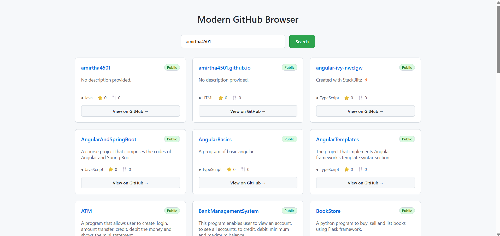

# 🚀 MODERN GITHUB BROWSER DASHBOARD (Angular 17+)

A modern Angular application built using **Standalone Components**, **Signals**, and the new **Control Flow syntax** (`@if`, `@for`) to search and explore GitHub repositories using the public GitHub REST API.



> Built with Angular 17+ (Standalone Architecture)

---

# 📌 Purpose of This Project

It demonstrates:

- ✔ Standalone Architecture (No NgModules)
- ✔ Angular Signals for state management
- ✔ Modern Control Flow (`@if`, `@for`)
- ✔ Signal-based component communication
- ✔ Clean component-based architecture
- ✔ Functional HttpClient setup

⚠️ This project intentionally avoids classic structural directives (`*ngIf`, `*ngFor`) and decorator-based `@Input/@Output` because those are covered in Project 1.

---

# 🛠 Tech Stack

- Angular 17+
- Standalone Components
- Angular Signals
- TypeScript
- RxJS
- GitHub REST API
- HttpClient (`provideHttpClient()`)

---

# 📁 Project Structure

```
modern-github-browser/
│
├── src/
│ ├── app/
│ │
│ │ ├── models/
│ │ │ └── repository.model.ts
│ │ │
│ │ ├── services/
│ │ │ └── github.service.ts
│ │ │
│ │ ├── components/
│ │ │ ├── search/
│ │ │ │ ├── search.component.ts
│ │ │ │ ├── search.component.html
│ │ │ │ └── search.component.css
│ │ │ │
│ │ │ ├── repo-list/
│ │ │ │ ├── repo-list.component.ts
│ │ │ │ ├── repo-list.component.html
│ │ │ │ └── repo-list.component.css
│ │ │ │
│ │ │ └── repo-card/
│ │ │ ├── repo-card.component.ts
│ │ │ ├── repo-card.component.html
│ │ │ └── repo-card.component.css
│ │ │
│ │ ├── app.component.ts
│ │ ├── app.component.html
│ │ └── app.config.ts
│ │
│ ├── styles.css
│ └── main.ts
│
└── angular.json
```


---

# 🧠 Modern Angular Concepts Demonstrated

| Feature | Implementation |
|----------|---------------|
| Standalone Components | All components |
| `bootstrapApplication()` | `main.ts` |
| `provideHttpClient()` | `app.config.ts` |
| `signal()` | App state management |
| `input()` | RepoCardComponent |
| `output()` | SearchComponent |
| `@if` | Conditional rendering |
| `@for` | Repository listing |
| Signal invocation (`repos()`) | Template binding |
| Reactive API handling | GithubService |

---

# 🏗 Architecture Overview

### 1️⃣ Standalone Architecture
- No `NgModule`
- Component-level imports
- Functional bootstrap
- Clean separation of responsibilities

---

### 2️⃣ Signals (Reactive State)
- `signal()` for reactive state
- `.set()` to update state
- Automatic UI re-rendering
- No manual change detection

---

### 3️⃣ Modern Control Flow
- `@if` instead of `*ngIf`
- `@for` instead of `*ngFor`
- Cleaner template syntax
- Better readability & performance

---

### 4️⃣ Component Communication (Modern)

- `input()` signal instead of `@Input()`
- `output()` signal instead of `@Output()`
- Strictly typed communication
- Unidirectional data flow

---

# 🔄 Application Flow

1. User enters GitHub username.
2. `SearchComponent` emits username using `output()`.
3. `AppComponent` updates `username` signal.
4. `GithubService` fetches repositories.
5. `repos` signal updates.
6. UI automatically refreshes via signals.

---

# 🧩 Component Breakdown

## 🔎 Search Component

- Signal-based `output()`
- Event handling
- Standalone configuration
- Clean form interaction

---

## 📂 Repo List Component

- `@for` repository loop
- `@if` conditional blocks
- Signal-based input
- Responsive grid layout

---

## 📦 Repo Card Component

- `input()` signal
- GitHub-style card design
- Public/Private badges
- Hover elevation effect
- External repository link

---

# 🎨 UI Characteristics

- GitHub-inspired styling
- Responsive card layout
- Hover animations
- Clean typography
- Professional spacing
- Modern minimal design

---

# 🛠 CLI Commands Used

```bash
ng new modern-github-browser --standalone
ng generate component components/search
ng generate component components/repo-list
ng generate component components/repo-card
ng generate service services/github

---

# 🧪 Run Development Server
ng serve


Open browser:

http://localhost:4200/

🏗 Production Build
ng build --configuration production


Build output:

dist/

🧪 Run Tests
ng test
